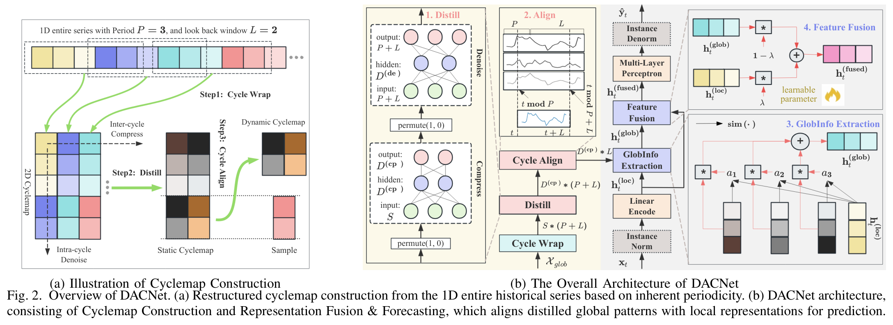
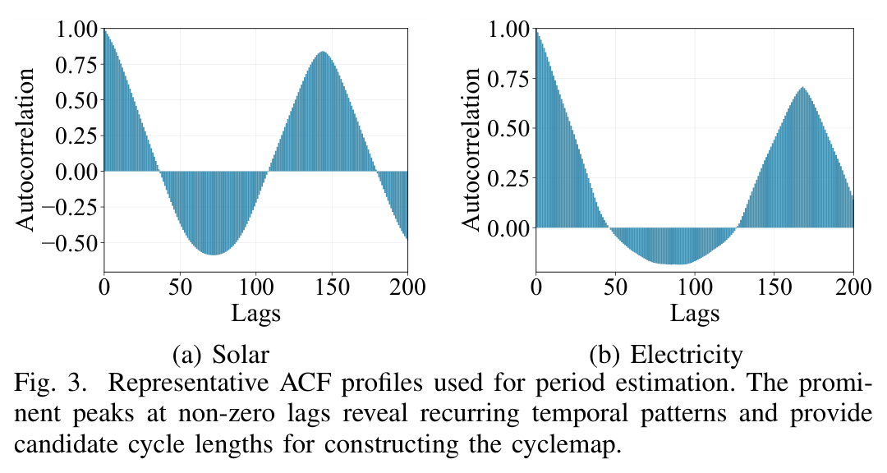
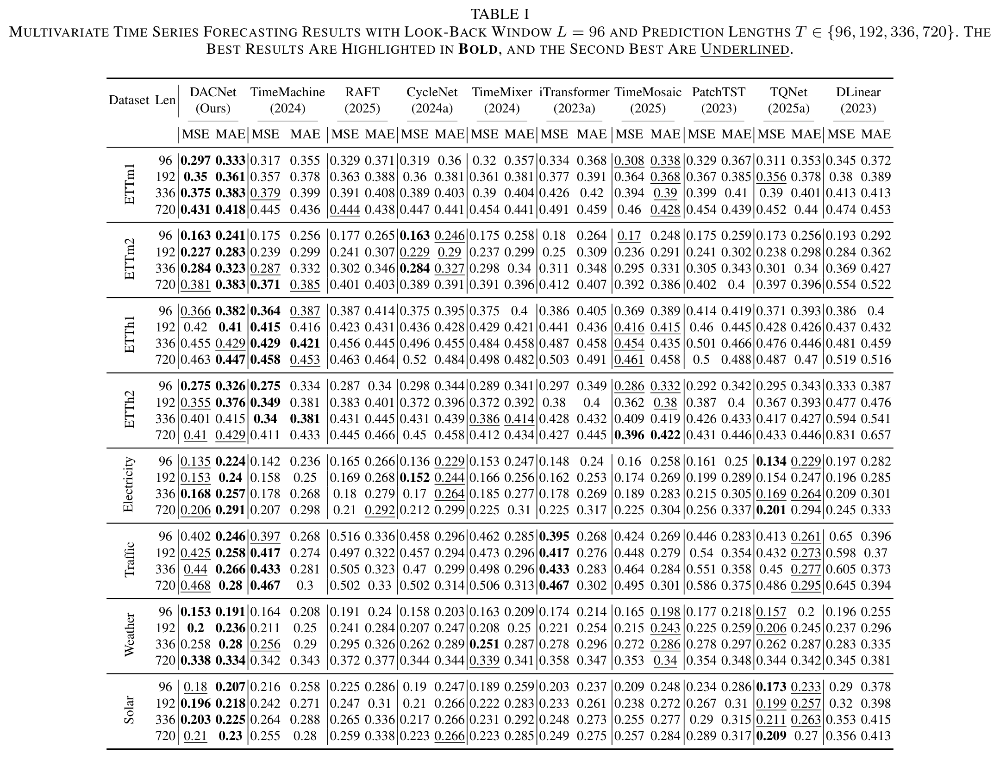
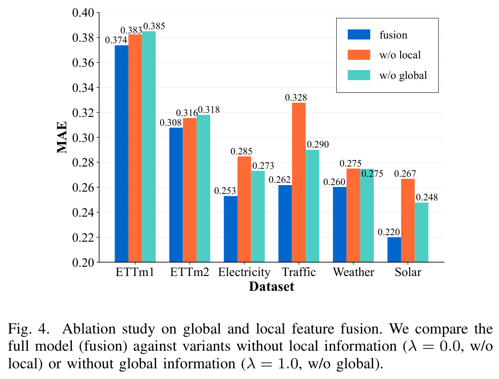
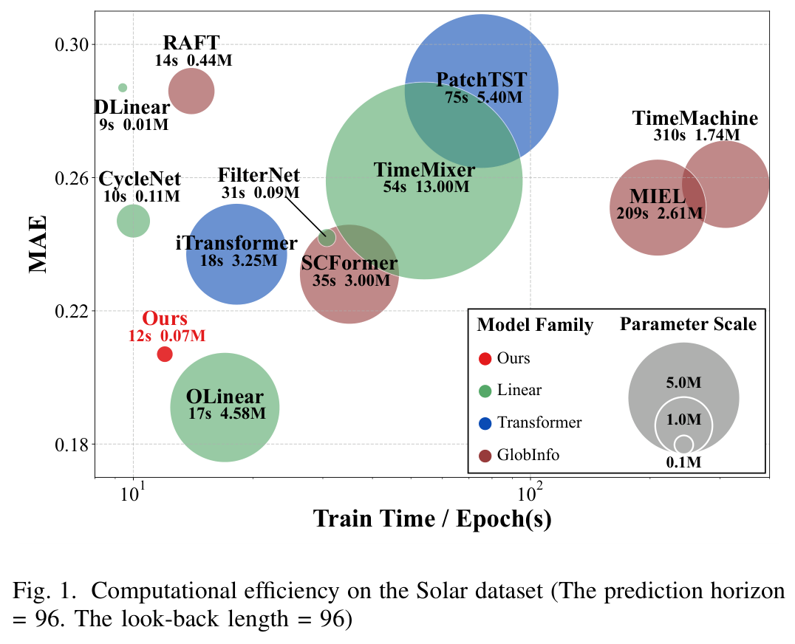
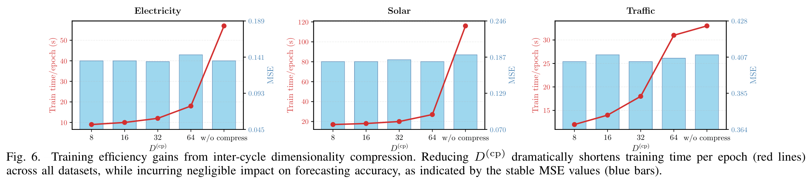
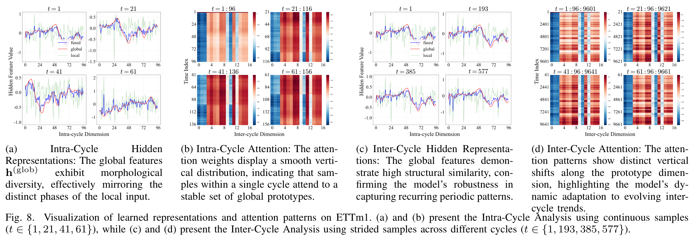

# DACNet

Implementation of **[DACNet: Distilled and Aligned Cyclemap Network for Efficient Time Series Forecasting](DACNet.pdf)**, accepted at **ICDM 2026**.

**Liang Yu, Mingzhe Qian, Jinhe Li, Lai Tu, and Tao Wu**

Huazhong University of Science and Technology

DACNet augments a local forecasting window with compact global patterns distilled from the full training history. This repository contains the original architecture (`DACNet_In`), a late fusion variant (`DACNet_Out`), and an ACF-based extension that estimates alignment from observed values.

- [1. Code and usage](#1-code-and-usage)
- [2. Paper overview](#2-paper-overview)

## 1. Code and usage

### Repository structure

| File or directory | Role |
| --- | --- |
| [`run_dacnet.py`](run_dacnet.py) | Main entry point for experiments using a dataset configuration. |
| [`run.py`](run.py) | Training and evaluation runner; exposes individual model and experiment arguments. |
| [`configs/`](configs/) | Dataset settings (`fixed`) and horizon-specific settings (`pred_len_configs`). |
| [`models/DACNet_In.py`](models/DACNet_In.py) | Original DACNet: enhance the historical input before forecasting. |
| [`models/DACNet_Out.py`](models/DACNet_Out.py) | Late fusion variant: enhance the backbone's forecast. |
| [`utils/cyclemap.py`](utils/cyclemap.py) | Fixed-period and ACF-based cyclemap construction, anchor matching, and SVD compression. |
| [`layers/Fusion.py`](layers/Fusion.py) | Cyclemap distillation, phase-aligned gathering, similarity weighting, and gated fusion. |
| [`layers/BackBone.py`](layers/BackBone.py) | Forecasting backbones. |
| [`data_provider/`](data_provider/) | Data loading, training-split scaling, and sample indices. |
| [`exp/exp_main.py`](exp/exp_main.py) | Build the training-history cyclemap, train, select checkpoints, and evaluate. |
| [`figures/`](figures/) | Figures and the main results table extracted from the paper. |

### Original model and late fusion variant

Let `L = seq_len`, `T = pred_len`, and `P = cycle`. Both models build their global cyclemap **only from the training split** and reuse that context for validation and testing. The raw map is arranged in the code as `[channels, intra-cycle positions, historical cycles]`.

| Model | Alignment target | Fusion location | Supported backbones |
| --- | --- | --- | --- |
| `DACNet_In` | The `L` observed historical values | Before the forecasting backbone | `linear`, `mlp`, `itransformer` |
| `DACNet_Out` | The `T` predicted future values | After the forecasting backbone | `linear`, `mlp`, `itransformer` |

**`DACNet_In` is the original architecture.** With `use_drift=0`, cycle wrapping uses windows of length `P + L` with stride `P`. For a sample beginning at global time index `t`, the model gathers `L` positions starting at phase `t % P` from the distilled cyclemap. A linear encoder transforms the historical input; similarity weights retrieve relevant global prototypes, and a learned gate fuses the local and global representations. The backbone then forecasts from this enhanced historical representation.

```text
Training history -> cycle wrap -> distill -> align to historical window --+
                                                                        |
Historical input -> instance norm -> linear encode -> retrieve and fuse -+-> backbone -> denorm -> forecast
```

**`DACNet_Out` is a late fusion variant.** The backbone first produces an initial `T`-step forecast from the historical input. Its cyclemap uses wrapping windows of length `P + T`, and alignment begins at `(t + L) % P`, the phase of the first future step. The fusion module encodes the initial forecast, matches it against global prototypes aligned to the prediction horizon, and returns an enhanced forecast. Alignment uses the future **time indices**; the fusion query is the model's own prediction, so future ground-truth values are not required.

<!-- In the current implementation, `DACNet_Out` always uses fixed-period cyclemap construction. The value-based alignment described below is implemented for `DACNet_In`. -->

### Value-based cyclemap construction and alignment: `use_drift=1`

This extension replaces fixed-period folding and modulo-based phase selection with **ACF peak detection and anchor matching**. Recurrence segments can begin at irregular intervals, and each input window is aligned using its observed values rather than a timestamp-derived phase.

1. **Construct the cyclemap from ACF peaks.** For each channel, compute autocorrelation over the training history and detect local maxima. The peak lags determine the starting positions of recurrence segments, establishing their intra-cycle origins in the raw cyclemap. Gather a contiguous segment from each selected start; these segments form the inter-cycle dimension. The implementation keeps the same number of peaks across channels by truncating each channel's peak list to the smallest count.
2. **Build an anchor bank.** Extract every length-`L` sliding window from the first 1,000 training observations. Each anchor represents a candidate starting offset in this reference region.
3. **Estimate the input's phase from values.** Compute Pearson correlation between the observed input and each anchor, separately for each channel. Sum these correlations across channels and select the anchor with the largest score. Thus, each sample receives one shared starting offset:

   $$p^* = \operatorname*{arg\,max}_{p}\sum_c \operatorname{corr}(x_c, a_{p,c}).$$

4. **Align and enhance the historical window.** Gather the distilled cyclemap at offsets `p* + [0, ..., L - 1]`, then apply the same similarity retrieval and fusion as in `DACNet_In`.

The ACF-based construction and anchor matching do not impose a fixed cycle length on segment starts or require calendar timestamps for alignment. `use_drift=1` changes cyclemap construction and alignment; it does not update the training-history map online. This extension is separate from the fixed-period method evaluated in the paper.

### Installation and data

Install the dependencies in [`requirements.txt`](requirements.txt):

```bash
python -m pip install -r requirements.txt
```

For CUDA execution, install a PyTorch build compatible with your CUDA environment. Run commands from the repository root and put the datasets under the directory passed to `--root_path`. The supplied configurations expect these filenames:

| `--dataset` | Data file | Channels | Configured `cycle` |
| --- | --- | ---: | ---: |
| `etth1`, `etth2` | `ETTh1.csv`, `ETTh2.csv` | 7 | 24 |
| `ettm1`, `ettm2` | `ETTm1.csv`, `ETTm2.csv` | 7 | 96 |
| `ecl` | `ECL.csv` | 321 | 168 |
| `traffic` | `Traffic.csv` | 862 | 168 |
| `weather` | `Weather.csv` | 21 | 144 |
| `solar` | `Solar.txt` | 137 | 144 |
| `exchange` | `Exchange.csv` | 8 | 1 |

<!-- CSV files contain a `date` column followed by the observed variables. `Solar.txt` contains comma-separated numeric observations without a header or timestamps. The loaders fit their standard scaler on the training split. -->

### Run experiments with `run_dacnet.py`

```bash
python run_dacnet.py --dataset etth1 --root_path ./datasets/ --gpu 0
```

Pass `--dataset` explicitly. The launcher reads `configs/<dataset>.yml`, merges `fixed` with the matching `pred_len_configs` entry, and invokes `run.py` for each configured horizon.

### Run a single setting or select a variant

<!-- For example, train the original model on ETTh1 for one horizon:

```bash
python run.py --is_training 1 --model DACNet_In --model_id ETTh1 --data ETTh1 --root_path ./datasets/ --data_path ETTh1.csv --enc_in 7 --seq_len 96 --pred_len 96 --cycle 24 --backbone mlp --d_model 256 --D_cp 16 --D_de 16 --use_norm 1 --sim_mode l1 --mix 0 --use_drift 0 --loss mse --learning_rate 0.005 --train_epochs 30 --batch_size 32 --patience 3 --random_seed 2024 --gpu 0 --num_workers 0
``` -->

For late fusion, replace `--model DACNet_In` with `--model DACNet_Out` and keep `--use_drift 0`. For ACF-based construction and anchor alignment, keep `--model DACNet_In` and change `--use_drift 0` to `--use_drift 1`.

<!-- The supplied command uses `--num_workers 0` for Windows compatibility. On systems that support the runner's multiprocessing setup, this can be increased. Setting `--is_training 0` evaluates an existing checkpoint; use the same model, data, hyperparameters, and seed as the training run. -->

### Key parameters and outputs

| Argument | Meaning |
| --- | --- |
| `--seq_len`, `--pred_len` | Historical window length and forecast horizon. |
| `--cycle` | Wrapping period for fixed-period cyclemap construction. |
| `--use_drift` | `0`: index-based phase alignment; `1`: ACF-based construction and anchor matching for `DACNet_In`. |
| `--D_cp`, `--D_de` | Inter-cycle compression dimension and intra-cycle denoising bottleneck dimension. |
| `--mix`, `--D_mix` | Enable optional channel mixing between compression and denoising, and set its bottleneck dimension. |
| `--sim_mode` | Retrieval similarity: `l1` (negative Manhattan distance), `l2` (negative Euclidean distance), `cosine`, `dot`, or `pearson`. |
| `--backbone`, `--d_model` | Forecasting backbone and its hidden dimension where applicable. |
| `--use_svd` | Enable SVD preprocessing capped at rank 8, with a 95% energy threshold. In `DACNet_In`, this replaces the learned compression and denoising blocks. |

The fusion gate in this implementation is factorized into learned channel and time-position factors. With `mix=0`, the cyclemap transformations and retrieval operate independently on each channel; enabling `mix=1` adds explicit interactions across channels.

<!-- Training saves the selected checkpoint under `checkpoints/<setting>/checkpoint.pth`. Evaluation appends MSE and MAE to `results.csv`. The current setting name includes the model, dataset identifier, window lengths, drift flag, and seed, but omits the training loss and several other hyperparameters. Use distinct `--model_id` values or checkpoint directories when retaining separate experiments with those differences.

**Reproduction settings:** `run.py` currently defaults to one training epoch, and the launcher inherits that default unless `train_epochs` is supplied in the YAML configuration. The paper uses up to 30 epochs with patience 3. The supplied configurations use `seq_len = 96`, matching the historical window length in the main comparison. Match the paper's training protocol and hyperparameter selection when reproducing its tables. -->

## 2. Paper overview

### Motivation

A short input window captures recent dynamics but provides limited evidence about recurring patterns and changes across cycles. The full training history contains this broader context, yet directly processing or retrieving long historical segments can add redundancy, noise, and computational cost. DACNet addresses this problem by restructuring the history into a cyclemap and distilling it before retrieving global information for a local input.

### Method



The method separates **intra-cycle variation**, which describes the shape within a recurrence, from **inter-cycle evolution**, which describes how corresponding phases change across historical cycles:

1. **Cycle wrap:** Fold the training history using stride `P` and window length `P + L`. The additional `L` observations preserve continuity when an aligned input window crosses a cycle boundary.
2. **Distill:** Compress the historical-cycle axis into `D_cp` latent prototypes, then denoise the intra-cycle axis through a bottleneck of width `D_de`. Compression precedes denoising so that the latter operates on fewer prototypes.
3. **Cycle align:** Slice `L` positions from the distilled map at the input's phase `t mod P`, producing a sample-specific dynamic cyclemap.
4. **Retrieve and fuse:** Linearly encode the input, compute negative Manhattan-distance similarities to the aligned prototypes, normalize them with softmax, and aggregate the global representation. A learned gate combines local and global features, and an MLP maps the fused representation to the forecast horizon.

The paper uses ACF peaks to estimate a dominant period for fixed-period cycle wrapping. Its representative ACF profiles are shown below. The repository's `use_drift=1` extension additionally uses peak lags as segment starts and observation-to-anchor matching for phase estimation, as described in Section 1.



### Experiments and results

The main evaluation covers **ETTh1, ETTh2, ETTm1, ETTm2, Electricity, Traffic, Weather, and Solar**, with `L = 96` and `T` in `{96, 192, 336, 720}`. The paper compares nine forecasting baselines and evaluates MSE and MAE. ETT uses a train/validation/test ratio of `2:1:1`; the other main benchmarks use `7:1:2`. Baseline accuracy results are taken from their original papers. DACNet is trained with a batch size of 32, at most 30 epochs, and early-stopping patience 3; the experiments use an NVIDIA RTX A6000.

**Forecasting accuracy.** DACNet achieves the best or tied-best error in **43 of 64** dataset-horizon-metric comparisons in Table I. Its error is among the two lowest distinct reported values in **57 of 64** comparisons, counting equal errors at the same rank. Gains vary by dataset and metric: for example, iTransformer has lower Traffic MSE at `T = 96`, while DACNet has lower MAE in that setting.



**Contribution of global context and distillation.** Removing either local or global information increases MAE on all six datasets in the fusion ablation. The compression/denoising ablation in Table II also favors using the two operations jointly over using either alone.



**Efficiency.** In the Solar comparison with `L = T = 96`, DACNet has approximately **0.07 million parameters** and trains in **12 seconds per epoch** under the reported setup. Inter-cycle compression reduces training time by up to **7 times on Solar** and about **3 times on Traffic**, with small changes in forecasting error. These measurements are specific to the paper's experimental settings.





**Backbone compatibility and additional analyses.** Adding the cyclemap improves all reported backbone/horizon/metric combinations for Linear, MLP, and iTransformer on Electricity and Traffic (Table III), with relative reductions reaching **27.9% in MSE** and **24.3% in MAE**. Additional experiments examine weak periodicity on Exchange with `P = 1`, period sensitivity, five-seed stability, SVD versus learned distillation, and optional channel mixing on Traffic. The Exchange results favor DACNet at three of the four horizons; PatchTST performs best at `T = 336`.

**Learned representations.** The ETTm1 visualizations compare samples at different phases within a cycle with samples at the same phase across cycles. They illustrate changes in the retrieved global shape with phase and shifts in prototype attention across historical cycles.



The paper's fixed-period method depends on period selection and temporal phase information, and its global map remains fixed after training. The value-based extension offers an alternative to index-based alignment; adaptation to a changing global history would require additional map updates.

### Citation

```bibtex
@inproceedings{yu2026dacnet,
  title     = {DACNet: Distilled and Aligned Cyclemap Network for Efficient Time Series Forecasting},
  author    = {Yu, Liang and Qian, Mingzhe and Li, Jinhe and Tu, Lai and Wu, Tao},
  booktitle = {2026 IEEE International Conference on Data Mining (ICDM)},
  year      = {2026},
  note      = {Accepted}
}
```

All images in this README are cropped directly from [`DACNet.pdf`](DACNet.pdf) at 300 dpi and retain their original figure or table numbering.
